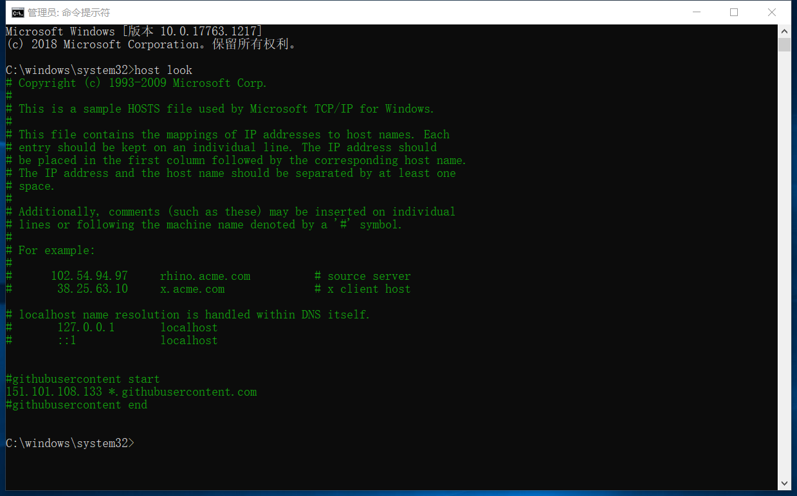
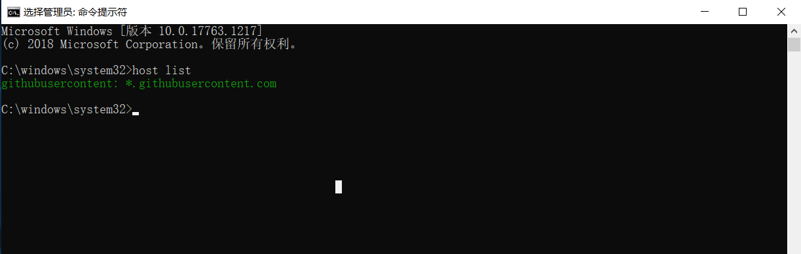
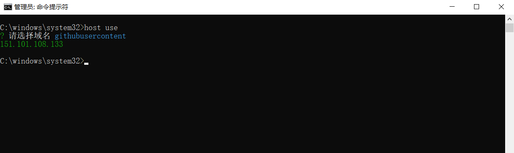
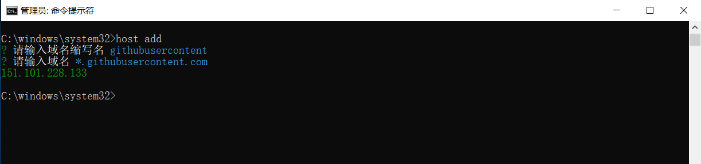

# refresh-host-cli
刷新host文件中域名对应的ip（在管理员身份下运行）

例如：
151.101.108.133 *.githubusercontent.com

1. host look：查看host文件

2. host list：查看已添加的key、value(domain)

3. host use：选择已存在的key、value(domain)

4. host add：添加key、value(domain)

### 域名解析采用[腾讯云单域名解析接口](https://cloud.tencent.com/document/product/379/3524)
